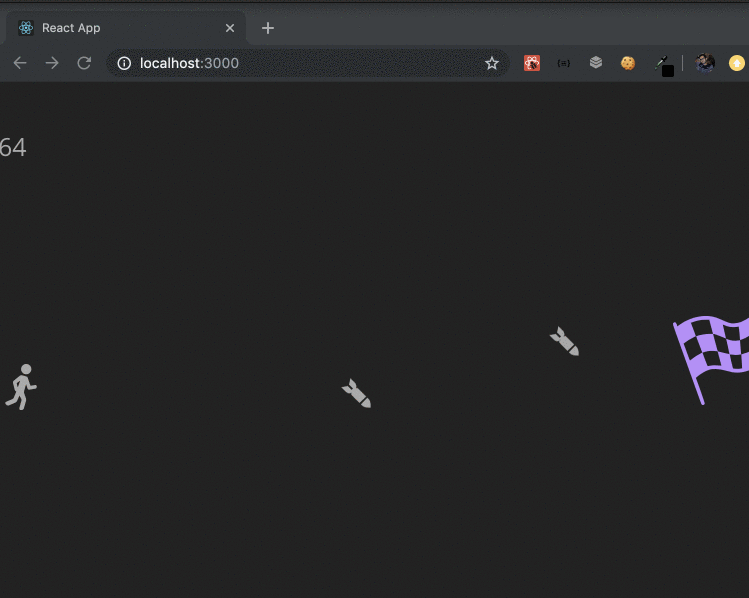

## Hiver Frontend Assignment 

This project was bootstrapped with [Create React App](https://github.com/facebook/create-react-app).

## Tasks to be completed
1. Left and right arrow should start the movement of the player in the respective direction.
2. If a player is hit by the missile, the Game should be over.
3. If a player reaches the flag escaping the missiles he wins.
4. Once a player starts moving he can only stop if he reaches the flag or he is hit by a missile.
5. Once the player wins, celebrate the win :+1: 

`IMPORTANT: You have to edit the existing boilerplate code to create the application.`

## Boilerplate Result

## Available Scripts

In the project directory, you can run:

### `npm start`

Runs the app in the development mode. 
Open [http://localhost:3000](http://localhost:3000) to view it in the browser.

The page will reload if you make edits. 
You will also see any lint errors in the console.

### `npm test`

Launches the test runner in the interactive watch mode. 
See the section about [running tests](https://facebook.github.io/create-react-app/docs/running-tests) for more information.

### `npm run build`

Builds the app for production to the `build` folder. 
It correctly bundles React in production mode and optimizes the build for the best performance.

The build is minified and the filenames include the hashes. 
Your app is ready to be deployed!

See the section about [deployment](https://facebook.github.io/create-react-app/docs/deployment) for more information.

